### Hey! I'm [Muktar](https://www.linkedin.com/in/muktarsayedsaleh/) 👋

Based in **Dubai, UAE**

A highly accomplished professional with a **24+ year track record** in software development, holding diverse roles including **VP of Engineering**, Director of Software Engineering, Technical Lead, Software Engineering Manager, and Solutions Architect. Passionate hands-on engineer since age 12, driving innovation and efficiency. Holds a Master's degree in Web Technologies, a Bachelor's in Software Engineering, and certifications in AWS, GCP, and Alibaba Cloud. Excel in solving complex challenges, leading diverse teams, and consistently delivering exceptional results.

My passionate journey with writing software started far back in my early childhood. I honed it through practical experience and academic studies. I hold a Bachelor's degree in Software Engineering (2011) and a Master's degree in Web Technologies (2016). Additionally, I have obtained multiple certifications in Cloud Computing, including 3x AWS, 3x GCP, and ALL Alibaba Cloud certifications.

Throughout my career, I have written numerous software applications for various platforms and environments. In recent years, my focus has been on **web and cloud-based applications**, **artificial intelligence and machine learning**, and **blockchain & self-sovereign identity (SSI)** solutions. I have worked directly with clients as a freelancer and indirectly within multinational startups and corporations, progressing from junior programmer to VP of Engineering.

Furthermore, I have explored my literary inclination and poetic talent, winning several prestigious local and Arab literary awards. I have published a collection of technical writings within my academic domain in addition to poetry books.

In summary, if I were to describe my entire life in one word, it would be **"writing."**

If my open source projects are useful for your **product/company** you can also sponsor my work on them. ☕

You can find me on:

* [My website: muktar.tech](https://muktar.tech/)
* [My blog](https://muktar.tech/blog)
* [GitHub as @muktarsayedsaleh (you are here)](https://github.com/muktarsayedsaleh)
* [LinkedIn](https://linkedin.com/in/muktarsayedsaleh)

---

### GitHub Stats

  

  

  

  

  

  

  

---

حيّاكم الله، أنا مختار سيّد صالح، مسلم، متزوّج و أب لطفلين (عمر و فرات). أعيش حالياً في **دبي، الإمارات**.

بدأت علاقتي بالكتابة بكتابة التطبيقات البرمجيّة منذ طفولتي المبكّرة قبل أكثر من **أربعة و عشرين عاماً** كهواية صقلتها خبرتي العمليّة و دراستي الأكاديميّة لاحقاً، أحمل درجة البكالوريوس في هندسة البرمجيات (٢٠١١) و درجة الماجستير في تقنيات الويب (٢٠١٦) كما أحمل شهادات عديدة في الحوسبة السحابية (٣ من AWS) و (٣ من GCP) و (كل شهادات Alibaba Cloud).

كتبت عشرات التطبيقات البرمجية لمعظم المنصات و البيئات قبل أن أتخصص في العقد الأخير في الويب و تطبيقاته بشكل أساسي و في السنوات الأخيرة في الحوسبة السحابية و الذكاء الصناعي و تعلّم الآلة و **تقنيات البلوكتشين و الهوية الرقمية ذاتية السيادة (SSI)**، كما عملت لسنوات طويلة مع العملاء بشكل مباشر أثناء عملي الحرّ، أو بشكل غير مباشر أثناء عملي في الشركات الناشئة و المؤسسات العملاقة متعددة الجنسيات و التي لعبت فيها معظم الأدوار التي يلعبها مهندسو البرمجيّات عادةً من قاعدة الهرم كمبرمج متدرّب إلى قمّته كنائب رئيس للهندسة (VP of Engineering)، كما حاولت تأسيس شركتي الخاصة لأكثر من مرّة و لم أوفّق لأسباب مختلفة علّمتني دروساً كثيرة عن الشركات الناشئة تأسيساً و إدارةً.

ظهر جانب آخر لعلاقتي بالكتابة عندما اكتشفتني ميولي الأدبيّة و ألحّت عليّ أرقاً و هواجس أظهرتني شاعراً كتب مجموعة من النصوص الشعريّة و فاز بالمركز الأول بعدّة جوائز أدبيّة محليّة و عربيّة مرموقة أهمّها: جائزة الشارقة للإبداع العربي (الإمارات - ٢٠١١) و جائزة جامعة الإمام لأفضل قصيدة عربيّة (السعودية - ٢٠١٦) و جائزة د.سعاد الصباح للإبداع الفكري و الأدبي مرّتين متتاليتين (الكويت - ٢٠١٧ و ٢٠٢١)، إضافة لإصداري مجموعة من المؤلّفات التقنيّة ضمن مجال الاختصاص الأكاديمي.

باختصار إن قُدِّرَ لإنسان أن يصف حياته كلها بكلمة واحدة، فالكلمة التي تصف حياتي كلّها بإيجاز و عمق شديد هي: "الكتابة".

يسعدني أن يقع اختيارك عليّ لتوظّفني أو لأساعدك في بناء شركتك الناشئة أو قيادة فريقك التقنيّ.

